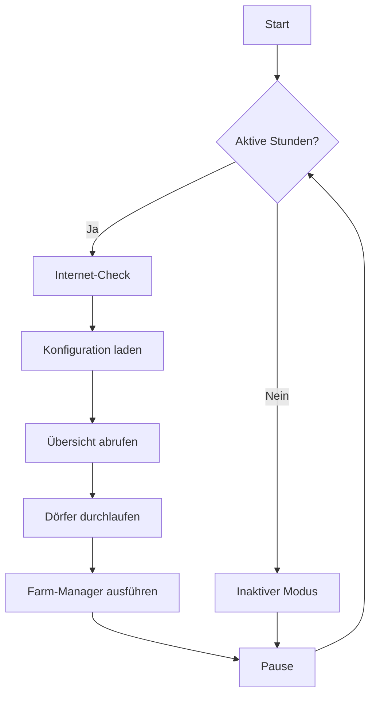

<div align="center">

# 🏰 Tribal Wars Bot (TWB)

### Ein hochentwickelter Open-Source-Bot für "Die Stämme"

[](https://www.python.org/)
[](LICENSE.md)
[](https://discord.gg/8PuzHjttMy)

TWB ist ein hochentwickelter Bot, der darauf ausgelegt ist, eine Vielzahl von Aufgaben im Spiel zu automatisieren. Von der Ressourcenverwaltung bis hin zur komplexen Angriffs- und Verteidigungsstrategie nimmt Ihnen TWB die repetitiven Aufgaben ab und ermöglicht es Ihnen, sich auf die strategische Planung zu konzentrieren.

[🚀 Installation](#-installation) • [📖 Dokumentation](#%EF%B8%8F-erster-start--konfiguration) • [💬 Discord](https://discord.gg/8PuzHjttMy) • [🐛 Issues](https://github.com/Themegaindex/TWB/issues)

</div>

---

## 💬 Discord-Community

Für Hilfe, Diskussionen und den Austausch mit anderen Nutzern gibt es einen [**offiziellen Discord-Server**](https://discord.gg/8PuzHjttMy).

---

## ⚠️ Wichtiger Hinweis (Disclaimer)

> **🚨 WARNUNG:** Die Nutzung dieses Bots verstößt gegen die Spielregeln von "Die Stämme" und kann zur **dauerhaften Sperrung** deines Accounts führen.
>
> Die Entwickler und Mitwirkenden dieses Projekts übernehmen **keine Haftung** für eventuelle Konsequenzen. Du nutzt diese Software **auf eigenes Risiko**.
>
> 💡 **Empfehlung:** Konfiguriere den Bot so, dass sein Verhalten menschlichem Spiel möglichst nahekommt (z. B. durch realistische Pausenzeiten), um das Entdeckungsrisiko zu minimieren.

---

## ✨ Features

<details open>
<summary><b>📋 Übersicht der Hauptfunktionen</b></summary>

### 🎮 Grundlegende Features

| Feature | Beschreibung |
|---------|--------------|
| 🤝 **Kooperativer Modus** | Spiele weiterhin über den Browser, während der Bot im Hintergrund Aufgaben verwaltet - ohne Konflikte |
| 🏗️ **Gebäudemanager** | Automatisiert den Ausbau von Gebäuden basierend auf anpassbaren Vorlagen (`templates`) |
| ⚔️ **Truppenmanager** | Rekrutiert automatisch Einheiten basierend auf Vorlagen und passt die Produktion an verfügbare Ressourcen an |
| 🛡️ **Verteidigungsmanager** | Reagiert auf eingehende Angriffe, evakuiert Truppen und fordert automatisch Unterstützung an |
| 🚩 **Flaggen-Management** | Weist Flaggen automatisch zu, um Boni (Ressourcenproduktion, Verteidigungsstärke) zu maximieren |
| 🔬 **Forschungs-Manager** | Führt automatisch Forschungen in der Schmiede durch, sobald die Voraussetzungen erfüllt sind |
| 👑 **Automatische Adelung** | Prägt Münzen und adelt vollautomatisch neue Dörfer |
| 📊 **Berichts-Manager** | Verarbeitet und analysiert eingehende Berichte automatisch |

### 🌾 Farm-Management (Erweitert)

- ✅ **Automatische Barbarensuche:** Sucht und farmt automatisch Barbarendörfer in der Umgebung
- 🧠 **Intelligente Optimierung:** Analysiert Berichte zur Effizienz-Bewertung und passt Farmziele dynamisch an
- 📈 **Adaptive Pausen:** Längere Pausen für Dörfer mit wenig Beute oder hohen Verlusten
- 🔒 **Beutelimit-Schutz:** Überwacht das weltweite Farm-Beutelimit und verhindert weitere Befehle bei Erreichen

#### 🚀 Smart Farming (NEU)

Das Smart Farming Feature ersetzt fehlende Template-Truppen intelligent durch verfügbare Einheiten:

| Funktion | Beschreibung |
|----------|--------------|
| 🎯 **Kapazitäts-basiert** | Berechnet die Ziel-Ladekapazität aus dem Template |
| 🔄 **Automatische Ersetzung** | Ersetzt nicht-verfügbare Truppen durch Alternativen |
| ⚡ **Prioritäts-System** | Bevorzugt effiziente Einheiten (Leichte Kavallerie > Späher > Axtkämpfer) |
| ⚙️ **Konfigurierbar** | Prioritätenliste in `smart_farming_priority` anpassbar |

**Beispiel:** Template fordert 20 Axtkämpfer (200 Kapazität), aber nur 10 verfügbar?
→ Smart Farming nimmt 10 Axtkämpfer + 4 Speerträger = gleiche Beute-Kapazität!

### 💰 Ressourcen-Management

#### 🏪 Marktplatz-Manager
Gleicht Ressourcen zwischen den Dörfern automatisch aus, um Engpässe zu vermeiden und den Bau zu beschleunigen.

#### 🔍 Ressourcensammler (Scavenger)
- 🔄 **Automatische Nutzung:** Nutzt freie Truppen zum Ressourcensammeln, wenn sie nicht für Farmen/Verteidigung benötigt werden
- 🔓 **Auto-Unlock:** Schaltet höhere Sammel-Stufen automatisch frei
- 🎯 **Intelligente Priorisierung:** Weist alle verfügbaren Truppen den effizientesten Operationen zu
- ⚙️ **Konfigurierbare Priorität:** Wähle zwischen Sammeln oder Farmen als Vorrang

### 🔧 Technische Features

| Feature | Beschreibung |
|---------|--------------|
| 🔐 **ReCaptcha-Umgang** | Umgeht Login-Captcha durch Browser-Cookies für ununterbrochenen Betrieb |
| 🖥️ **Web-Interface** | Lokales Dashboard zur Überwachung und Steuerung des Bots |
| 📱 **Telegram-Benachrichtigungen** | Informiert dich über wichtige Ereignisse (z.B. Angriffe) |
| 🔄 **Dynamische Konfiguration** | Neu eroberte Dörfer werden automatisch hinzugefügt; Updates werden intelligent zusammengeführt |

</details>

---

## 🚀 Installation

<details open>
<summary><b>📦 Setup-Anleitung</b></summary>

### 1️⃣ Voraussetzungen

| Anforderung | Details |
|-------------|---------|
| 🐍 **Python 3.x** | Installiere Python von der [offiziellen Website](https://www.python.org/downloads/)<br>⚠️ **Wichtig:** Aktiviere bei der Installation "Add Python to PATH" |
| 📁 **Bot-Dateien** | Lade das Projekt von GitHub herunter:<br>• Via Git: `git clone https://github.com/Themegaindex/TWB.git`<br>• Oder als [ZIP-Datei](https://github.com/Themegaindex/TWB/archive/refs/heads/master.zip) |

### 2️⃣ Abhängigkeiten installieren

Öffne eine Kommandozeile (Terminal, PowerShell, CMD) im Hauptverzeichnis des Bots:

```bash
# Standard-Installation
pip install -r requirements.txt

# Bei mehreren Python-Versionen
python -m pip install -r requirements.txt
```

### 3️⃣ Bot starten

```bash
python twb.py
```

> 💡 **Hinweis:** Beim ersten Start wird ein interaktiver Einrichtungs-Wizard gestartet, der dich durch die Grundkonfiguration führt.

</details>

---

## ⚙️ Erster Start & Konfiguration

<details>
<summary><b>🎯 Konfigurations-Wizard</b></summary>

Die gesamte Steuerung des Bots erfolgt über die zentrale Konfigurationsdatei `config.json`.

### 🧙 Der Setup-Wizard

Beim ersten Start von `python twb.py` wirst du durch einen interaktiven Wizard geführt:

| Schritt | Information | Beispiel |
|---------|-------------|----------|
| 1️⃣ **Spiel-URL** | Die vollständige URL aus deinem Browser | `https://de123.die-staemme.de/game.php?village=12345&screen=overview` |
| 2️⃣ **User-Agent** | Dein Browser-User-Agent (Google: "what is my user agent") | `Mozilla/5.0 (Windows NT 10.0; Win64; x64)...` |

> ✅ Nach Abschluss wird eine `config.json` erstellt und der Bot ist einsatzbereit!

</details>

<details>
<summary><b>📝 Detaillierte Konfiguration</b></summary>

Die `config.json` kann mit jedem Texteditor bearbeitet werden. Änderungen werden beim nächsten Bot-Durchlauf automatisch geladen.

### 🌐 `server` - Server-Einstellungen

| Parameter | Beschreibung | Beispiel |
|-----------|--------------|----------|
| `server` | Kurzname deines Servers | `"de123"` |
| `endpoint` | URL zum Spiel-Endpunkt | `"https://de123.die-staemme.de/game.php"` |
| `server_on_twstats` | Server auf twstats.com gelistet? | `true` / `false` |

---

### 🤖 `bot` - Bot-Verhalten

| Parameter | Beschreibung | Wert |
|-----------|--------------|------|
| `active_hours` | Aktive Stunden | `"6-23"` (06:00-23:00 Uhr) |
| `active_delay` | Wartezeit zwischen Aktionen (aktiv) | Sekunden |
| `inactive_delay` | Wartezeit zwischen Aktionen (inaktiv) | Sekunden |
| `inactive_still_active` | Aktionen auch im inaktiven Modus? | `true` / `false` |
| `add_new_villages` | Neue Dörfer automatisch hinzufügen? | `true` / `false` |
| `user_agent` | ⚠️ Browser-User-Agent (wichtig!) | Dein User-Agent |
| `farm_bag_limit_margin` | Sicherheitsabstand zum Beutelimit | `0.0` - `0.2` |

---

### 🏗️ `building` - Gebäudemanager

| Parameter | Beschreibung |
|-----------|--------------|
| `manage_buildings` | Gebäudeverwaltung aktiviert |
| `default` | Standard-Bauvorlage (aus `templates/builder/`) |
| `max_lookahead` | Max. überspringbare Gebäude (empfohlen: < 5) |
| `max_queued_items` | Max. Gebäude in der Bauschleife |

---

### ⚔️ `units` - Truppenrekrutierung

| Parameter | Beschreibung |
|-----------|--------------|
| `recruit` | Rekrutierung aktiviert |
| `upgrade` | Automatische Forschung |
| `default` | Standard-Truppenvorlage (aus `templates/troops/`) |
| `batch_size` | Einheiten pro Rekrutierung (Lategame: 500-1500) |
| `manage_defence` | Verteidigungsmanagement aktiviert |

---

### 🏘️ `village_template` - Dorf-Vorlage

Diese Vorlage wird für neu hinzugefügte Dörfer verwendet. Jedes Dorf kann individuell überschrieben werden.

| Parameter | Beschreibung | Standard |
|-----------|--------------|----------|
| `building` | Bauvorlage für dieses Dorf | Übernimmt global |
| `units` | Truppenvorlage für dieses Dorf | Übernimmt global |
| `managed` | Dorf vom Bot verwalten? | `true` |
| `prioritize_building` | Rekrutierung pausieren bis Bauschleife voll? | `false` |
| `prioritize_snob` | Ressourcen für AGs reservieren? | `false` |
| `snobs` | Max. Anzahl AGs | `0` |
| `farm_bag_limit_override` | Beutelimit-Override | `null` (global) |
| `additional_farms` | Zusätzliche Farm-IDs | `[]` |

#### 🔍 Sammel-Optionen (Scavenger)

| Parameter | Beschreibung |
|-----------|--------------|
| `gather_enabled` | Ressourcensammlung aktiviert |
| `gather_selection` | Max. Sammel-Stufe (1-4) |
| `advanced_gather` | Intelligente Truppen-Zuweisung |
| `prioritize_gathering` | Sammeln vor Farmen? |

> 🔓 **Auto-Unlock:** Der Bot schaltet höhere Sammel-Slots automatisch frei!

---

### 🌾 `farms` - Farm-Manager

| Parameter | Beschreibung |
|-----------|--------------|
| `farm` | Farming aktiviert |
| `search_radius` | Suchradius für Barbarendörfer (Felder) |
| `default_away_time` | Standard-Wartezeit zwischen Angriffen (Sekunden) |
| `full_loot_away_time` | Wartezeit bei voller Beute |
| `low_loot_away_time` | Wartezeit bei geringer Beute |
| `max_farms` | Max. Farmen pro Dorf |
| `forced_peace_times` | Zeiträume ohne Angriffe |

#### 🚀 Smart Farming Konfiguration

| Parameter | Beschreibung | Standard |
|-----------|--------------|----------|
| `smart_farming` | Smart Farming aktiviert | `false` |
| `smart_farming_priority` | Prioritätenliste der Ersatz-Einheiten | `["light", "marcher", "heavy", "spear", "axe", "sword", "archer"]` |

> 💡 **Wie funktioniert Smart Farming?**
>
> Wenn dein Farm-Template z.B. 20 Axtkämpfer fordert, aber nur 10 verfügbar sind:
> 1. **Phase 1:** Nimmt die 10 verfügbaren Axtkämpfer (100 Kapazität)
> 2. **Phase 2:** Füllt die fehlende Kapazität (100) mit Prioritäts-Einheiten auf
> 3. **Ergebnis:** 10 Axtkämpfer + 4 Speerträger = 200 Kapazität (wie ursprünglich gewollt)
>
> Die Prioritätenliste bestimmt, welche Einheiten bevorzugt werden. Leichte Kavallerie (`light`) hat 80 Kapazität und ist daher effizienter als Speerträger (`spear`) mit 25.

---

### 🏪 `market` - Marktplatz

| Parameter | Beschreibung |
|-----------|--------------|
| `auto_trade` | Automatische Marktplatz-Angebote |
| `max_trade_duration` | Max. Angebotsdauer (Stunden) |
| `trade_multiplier` | Ungleiche Tauschgeschäfte erstellen |

---

### ⚖️ `balancer` - Ressourcen-Koordinator

| Parameter | Beschreibung |
|-----------|--------------|
| `enabled` | Balancer aktiviert |
| `mode` | Strategie (`requests_only`, `requests_first`, `balance_even`) |
| `needs_more_pct` | Max. Auffüllung (% der Lagerkapazität) |
| `built_out_pct` | Min. Puffer für Spender (% des Lagers) |
| `max_shipments_per_run` | Max. Bestellungen pro Lauf |
| `min_chunk` | Min. Versandgröße (entspricht 1 Händler = 1000) |
| `transfer_cooldown_min` | Sperrzeit für Route (Minuten, 0 = deaktiviert) |
| `block_when_under_attack` | Angegriffene Dörfer ausschließen |
| `dry_run` | Test-Modus (nur Logs, keine Händler) |

> 💡 **Tipp:** Teste mit `dry_run: true` bevor du den Balancer aktivierst!

> ℹ️ **Per-Dorf-Override:** In `villages.<id>.balancer_enabled` kannst du einzelne Dörfer ein- oder ausschließen.

---

### 🌍 `world` - Welt-Einstellungen

Werden automatisch erkannt und gesetzt:

- `knight_enabled`, `flags_enabled`, `quests_enabled`
- `farm_bag_limit_enabled` - Farm-Beutelimit-Schutz
- `farm_bag_block_scouts` - Scout-Läufe bei Limit stoppen

---

### 📊 `reporting` & 📱 `notifications`

#### Logging
- `enabled` - Detailliertes Log aktivieren
- `connection_string` - Speicherort (Standard: `file://cache/logs/twb_{ts}.log`)

#### Telegram-Benachrichtigungen
- `enabled` - Benachrichtigungen aktivieren
- `channel_id` - Deine Telegram Chat-ID
- `token` - Telegram-Bot-Token

</details>

---

## 🔧 Funktionsweise (Wie es funktioniert)

<details>
<summary><b>⚙️ Interne Abläufe des Bots</b></summary>

### 🔐 Login und Anti-Captcha

"Die Stämme" schützt den normalen Login-Vorgang mit einem ReCaptcha, was eine Automatisierung erschwert. TWB umgeht dieses Problem auf elegante Weise: Anstatt sich mit Benutzername und Passwort anzumelden, verwendet der Bot eine **gültige Sitzungs-Cookie**.

**Wie funktioniert das?**
1. Du loggst dich normal im Browser in deinen Account ein.
2. Dein Browser erhält vom Spieleserver ein Cookie, das deine Sitzung identifiziert.
3. Du kopierst den Wert dieses Cookies und fügst ihn beim ersten Start des Bots ein.
4. Der Bot sendet dieses Cookie bei jeder Anfrage an den Server und erscheint so, als wäre er ein ganz normaler, eingeloggter Browser.

> ⚠️ **Wichtig:** Diese Cookies haben eine begrenzte Lebensdauer. Um zu vermeiden, dass der Bot plötzlich ausgeloggt wird, solltest du dich **mindestens 1-2 Mal pro Tag im Browser neu einloggen** und dem Bot bei Aufforderung ein frisches Cookie zur Verfügung stellen. Ein 24/7-Betrieb mit einem einzigen Cookie ist ein hohes Risiko für eine Sperre.

---

### 🔄 Der Hauptprozess (`twb.py`)

Der Bot operiert in einer Endlosschleife, die bei jedem Durchlauf folgende Schritte ausführt:



1. **Prüfung der aktiven Stunden:** Der Bot prüft, ob er sich in den in der Konfiguration definierten `"active_hours"` befindet.
2. **Internet-Check:** Eine kurze Prüfung, ob eine Internetverbindung besteht.
3. **Konfiguration laden:** Die `config.json` wird neu eingelesen, um Änderungen zu übernehmen.
4. **Übersicht abrufen:** Der Bot lädt die Dorf-Übersichtsseite. Dadurch erkennt er die aktuell verfügbaren Dörfer und die Welteinstellungen (z.B. ob Ritter oder Flaggen aktiv sind).
5. **Dörfer durchlaufen:** Der Bot iteriert durch jedes in der `config.json` als `"managed": true` markierte Dorf und führt die entsprechenden Aktionen aus (Bauen, Rekrutieren, Farmen etc.).
6. **Farm-Manager ausführen:** Nach dem Durchlauf aller Dörfer wird der globale Farm-Manager (`farm_manager`) aufgerufen, um die Farm-Statistiken zu analysieren und zu optimieren.
7. **Pause:** Der Bot pausiert für die in `"active_delay"` oder `"inactive_delay"` definierte Zeit, plus eine zufällige Spanne, um menschliches Verhalten zu simulieren.

---

### 📊 Automatisches Farm-Management (`manager.py`)

Eine der stärksten Funktionen des Bots ist die selbstständige Optimierung der Farm-Effizienz. Dies geschieht durch die Analyse der im `cache/reports/` Ordner gespeicherten Berichte.

| Profil | Kriterium | Aktion |
|--------|-----------|--------|
| 🟢 **High Profile** | Konstant hohe Beute | Häufigere Angriffe |
| 🟡 **Low Profile** | Geringe Beute oder leichte Verluste | Längere Pausen |
| 🔴 **Unsicher** | Konstant hohe Verluste (>50%) | Nicht mehr angreifen |

*   **Analyse:** Der `farm_manager` berechnet für jede Farm die durchschnittliche Beute und die prozentualen Truppenverluste.
*   **Profil-Anpassung:** Farmen mit konstant hoher Beute werden als `"high_profile"` markiert und häufiger angegriffen, während Farmen mit geringer Beute oder leichten Verlusten als `"low_profile"` markiert werden, und die Pause bis zum nächsten Angriff wird erhöht.
*   **Sicherheits-Check:** Wenn eine Farm konstant hohe Verluste (>50%) verursacht, wird sie als unsicher (`"safe": false`) markiert und nicht mehr automatisch angegriffen.

---

### 🖥️ Das Web-Interface

TWB enthält ein optionales Web-Interface, das eine visuelle Übersicht über den Bot-Status bietet.

```bash
# Navigiere in das webmanager Verzeichnis
cd webmanager

# Starte den Server
python server.py
```

Öffne deinen Browser und gehe zu `http://127.0.0.1:5000/`, um das Dashboard zu sehen.

---

### 🔄 Automatische Konfigurations-Aktualisierung

Wenn der Bot aktualisiert wird und neue Konfigurations-Optionen in der `config.example.json` hinzukommen, erkennt TWB dies automatisch. Deine bestehende `config.json` wird gesichert (`config.bak`) und die neuen Optionen werden intelligent hinzugefügt, **ohne deine bisherigen Einstellungen zu überschreiben**. Dies stellt sicher, dass deine Konfiguration immer auf dem neuesten Stand ist, ohne dass du sie manuell anpassen musst.

</details>

---

## ❓ FAQ (Häufig gestellte Fragen)

<details>
<summary><b>🔑 Wie bekomme ich das Browser-Cookie?</b></summary>

Das Cookie findest du in den Entwicklertools deines Browsers (Taste **F12**).

1. Gehe zum **"Netzwerk"** (oder "Network") Tab.
2. Lade die Spielseite neu (**F5**).
3. Suche nach einer Anfrage, die `game.php` heißt.
4. Klicke darauf und suche in den **"Anfrage-Headern"** (Request Headers) nach dem `cookie:` Eintrag. Kopiere den gesamten Wert.


</details>

<details>
<summary><b>🔴 Was soll ich tun, wenn der Bot abstürzt?</b></summary>

Der Bot ist so konzipiert, dass er sich nach einem Absturz bis zu **dreimal selbst neu startet**.

Wenn er dauerhaft abstürzt, überprüfe die Log-Dateien im `cache/logs/` Ordner. Dort findest du detaillierte Fehlermeldungen, die dir (oder der Community im Discord) helfen können, das Problem zu diagnostizieren.

</details>

<details>
<summary><b>⚠️ Wie hoch ist das Risiko, gesperrt zu werden?</b></summary>

Das Risiko ist **real** und sollte nicht unterschätzt werden. Um es zu minimieren:

- ✅ Verwende realistische Pausenzeiten (`active_delay`).
- ✅ Nutze die `"active_hours"`, um eine "Schlafenszeit" für den Bot zu simulieren.
- ✅ Aktualisiere dein Cookie regelmäßig.
- ✅ Vermeide es, den Bot auf brandneuen Welten oder mit einem neuen Account zu aggressiv zu nutzen.

</details>

<details>
<summary><b>🔄 Wie aktualisiere ich den Bot auf eine neue Version?</b></summary>

**Mit Git:**
```bash
git pull
```

**Ohne Git:**
1. Lade die neue Version herunter
2. Entpacke sie
3. Kopiere deine `config.json` in den neuen Ordner

> 💡 Dank der automatischen Konfigurations-Aktualisierung bleiben deine Einstellungen erhalten!

</details>

---

## 💡 Verbesserungsvorschläge

Dieses Projekt hat eine solide Basis, aber es gibt immer Raum für Weiterentwicklungen. Hier sind einige Ideen:

| Kategorie | Vorschlag |
|-----------|-----------|
| 🔒 **Anti-Bot-Erkennung** | Implementierung von zufälligeren Klickpfaden, variableren Timings und Mausbewegungs-Simulation (z.B. über Selenium oder Playwright) |
| 🖥️ **Web-Interface** | Interaktive Elemente zum Ändern von Konfigurationen, manuelles Starten von Bauaufträgen oder detaillierte Dorf-Statistiken |
| 👥 **Multi-Account** | Verwaltung mehrerer Accounts (z.B. auf unterschiedlichen Welten) von einer einzigen Bot-Instanz |
| ✏️ **Vorlagen-Editor** | Tool oder Web-UI-Bereich zum Erstellen und Anpassen von Bau- und Truppenvorlagen |

---

## 🛠️ Dla Deweloperów (Antygravity Fork)

### Uruchamianie testów

```bash
# Zainstaluj zależności deweloperskie
pip install pytest black mypy

# Uruchom wszystkie testy
pytest tests/

# Uruchom konkretny moduł
pytest tests/test_farm_manager.py -v
```

### Praca z AI (Claude Code)

Ten fork zawiera pliki instrukcji dla asystentów AI:

- **`AGENTS.md`** — główne instrukcje dla agentów AI pracujących nad projektem
- **`.ai_docs/`** — dokumentacja architektury generowana i używana przez AI
- **`.claude/`** — konfiguracja Claude Code

Przed rozpoczęciem pracy z Claude Code przeczytaj `AGENTS.md`.

### Narzędzia pomocnicze

Dodatkowe skrypty deweloperskie znajdziesz w `tools/`.

---

## 📄 Lizenz

Dieses Projekt steht unter der **GNU General Public License v3.0**. Details findest du in der [LICENSE.md](LICENSE.md) Datei.

---

<div align="center">

**Made with ❤️ by the TWB Community**

[⬆ Zurück nach oben](#-tribal-wars-bot-twb)

</div>
