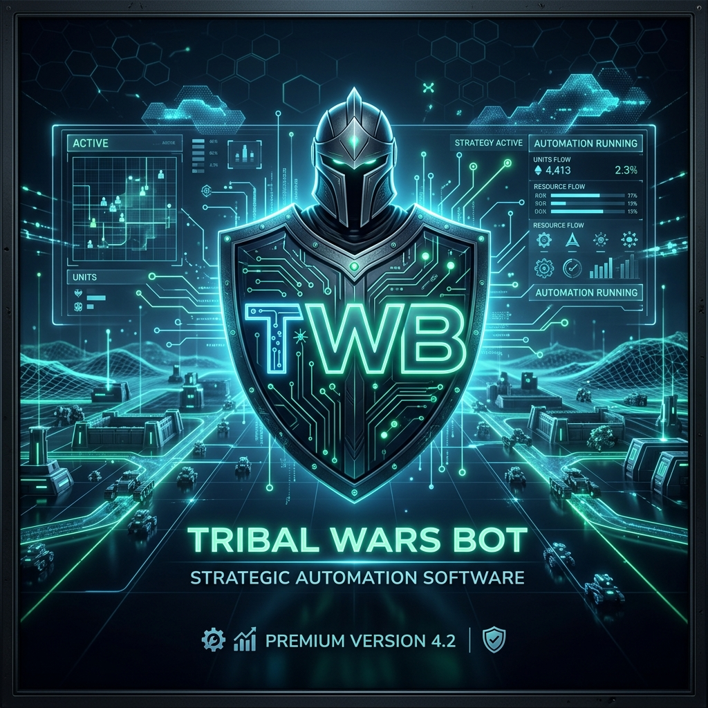

# <p align="center">🛡️ TWB - Tribal Wars Bot 🛡️</p>

<p align="center">
  
</p>

<p align="center">
  
  
  
  
  
</p>

---

## 🌟 O projekcie

**TWB (Tribal Wars Bot)** to profesjonalne, zautomatyzowane narzędzie do zarządzania kontem w popularnej grze przeglądarkowej „Plemiona”. Projekt został stworzony z myślą o maksymalnej efektywności, inteligentnym planowaniu strategicznym oraz bezpieczeństwie konta (low-detection).

Bot łączy w sobie potężny silnik logiki wykonawczej z nowoczesnym panelem sterowania w przeglądarce, pozwalając na pełną kontrolę nad imperium w czasie rzeczywistym.

---

## 🚀 Kluczowe Funkcje

### 🌾 **Smart Farming (Inteligentne Farmienie)**
*   **Algorytm Morning Rush**: Precyzyjne uderzenia tuż po zakończeniu bonusu nocnego (celownik w 08:00:01).
*   **Estymacja Surowców**: Dynamiczne obliczanie opłacalności wysyłki na podstawie zwiadów i historycznych raportów.
*   **Adaptive Targeting**: Automatyczne omijanie wiosek z dużymi stratami lub niskim łupem.
*   **Multi-Unit Support**: Obsługa LK, Zwiadu, Toporników i innych jednostek zgodnie z priorytetami.

### 🏗️ **Automatyczny Rozwój (Building & Recruit Manager)**
*   **Building Queue**: Zaawansowana kolejka budowy z obsługą zależności i optymalizacją kosztów.
*   **Smart Recruitment**: Utrzymywanie balansu wojsk zgodnie z wybranym szablonem (ofensywny/defensywny).
*   **Technological Advancement**: Automatyczne badania w kuźni.

### 🛡️ **Military Operations & Defense**
*   **Defense Mixin**: Automatyczna detekcja nadchodzących ataków i powiadomienia (Telegram).
*   **Safe Evacuation**: Możliwość ewakuacji wojsk ofensywnych przed nadchodzącym atakiem.
*   **Support System**: Automatyczne wysyłanie wsparcia między własnymi wioskami.

### 📊 **Panel Zarządzania (Web Dashboard)**
Nowoczesny interfejs Flask zapewniający:
*   **Live Map**: Interaktywna mapa świata z historią ataków i statystykami wiosek.
*   **Template Editor**: Wizualny edytor szablonów budynków i wojsk.
*   **Config Hub**: Łatwa zmiana ustawień bota bez konieczności edycji plików JSON.
*   **Browser Extension Sync**: Automatyczna synchronizacja ciasteczek (SID) i user-agent bezpośrednio z Twojej przeglądarki.

---

## 🛠️ Architektura Systemu

Projekt opiera się na modułowej strukturze, która ułatwia rozwój i testowanie:

*   📂 `core/`: Rdzeń komunikacyjny (HTTP Wrapper, Database Manager, Notifications).
*   📂 `game/`: Logika gry (Parsing raportów, zarządzanie wioską, mixiny akcji).
*   📂 `webmanager/`: Backend panelu WWW (Flask API, Map Builder).
*   📂 `templates/`: Gotowe schematy rozwoju i ustawienia wojsk.
*   📂 `scripts/`: Narzędzia pomocnicze (np. synchronizacja z TribalWarsMap).

---

## 📦 Instalacja i Uruchomienie

### Wymagania
*   **Python 3.9+**
*   **PostgreSQL** (Dla pełnej funkcjonalności mapy i raportów)
*   **Venv** (Zalecane)

### Kroki
1.  **Sklonuj repozytorium**:
    ```bash
    git clone https://github.com/JakubPisula/TWB.git
    cd TWB
    ```
2.  **Przygotuj środowisko**:
    ```bash
    python -m venv env
    source env/bin/activate  # Linux
    pip install -r requirements.txt
    ```
3.  **Skonfiguruj bota**:
    ```bash
    cp config.example.json config.json
    # Edytuj config.json lub użyj kreatora przy pierwszym uruchomieniu
    ```
4.  **Uruchom bota**:
    ```bash
    python twb.py
    ```
5.  **Dostęp do panelu**:
    Otwórz w przeglądarce `http://localhost:5000`

---

## 🛡️ Bezpieczeństwo i Disclaimer

Projekt został stworzony w celach edukacyjnych i badawczych. TWB implementuje zaawansowane mechanizmy maskowania (random delays, browser-like headers), jednak korzystanie z botów jest niezgodne z regulaminem gry "Plemiona". 

> [!CAUTION]
> Korzystasz z tego narzędzia na własną odpowiedzialność. Twórcy nie ponoszą odpowiedzialności za ewentualne blokady kont.

---

## 📜 Licencja

Projekt dystrybuowany na licencji **MIT**. Szczegóły znajdziesz w pliku `LICENSE`.

---

<p align="center">
  Stworzone z ❤️ dla graczy Plemion.
</p>
