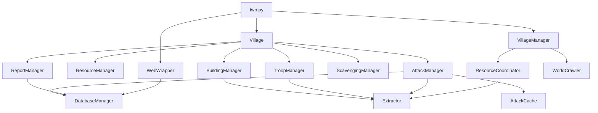

# Analiza Projektu TWB (Tribal Wars Bot) - Relacje i Architektura

Niniejszy dokument przedstawia szczegółową analizę struktury projektu, funkcjonalności poszczególnych modułów, ich wzajemnych zależności oraz identyfikuje potencjalne konflikty architektoniczne.

---

## 1. Przegląd Architektury

Projekt TWB opiera się na architekturze modułowej z wyraźnym podziałem na warstwę rdzenia (`core/`), warstwę logiki gry (`game/`) oraz warstwę orkiestracji (`twb.py`, `manager.py`).

- **Core**: Infrastruktura (HTTP, Baza Danych, Parsowanie HTML, Modele danych).
- **Game**: Logika biznesowa specyficzna dla gry (Zarządzanie wioską, wojskiem, budynkami, atakami).
- **Orkiestracja**: Główna pętla bota, zarządzanie konfiguracją i zadaniami globalnymi.

---

## 2. Analiza Komponentów Rdzenia (Core)

### `WebWrapper` (core/request.py)
- **Funkcjonalność**: Jedyny punkt styku z serwerem gry. Zarządza sesją `requests.Session`, ciasteczkami, tokenami CSRF oraz detekcją systemów anty-botowych (captcha).
- **Zależności**: `DatabaseManager`, `FileManager`, `Notification`, `ReporterObject`.
- **Rola**: Realizuje zapytania GET i POST, emulując zachowanie przeglądarki (losowe opóźnienia, nagłówki).

### `DatabaseManager` (core/database.py) & `Models` (core/models.py)
- **Funkcjonalność**: Warstwa persystencji danych oparta na SQLAlchemy. Obsługuje SQLite (lokalnie) lub PostgreSQL.
- **Zależności**: `models.py`, `FileManager`.
- **Dane**: Przechowuje informacje o wioskach, graczach, raportach, atakach i sesjach.

### `Extractor` (core/extractors.py)
- **Funkcjonalność**: Zestaw statycznych metod parsujących surowy HTML z gry przy użyciu wyrażeń regularnych (Regex) i JSON.
- **Zależności**: Brak (moduł narzędziowy).
- **Rola**: Wyciąga stan gry (`game_data`), poziomy budynków, liczbę wojsk, ID wiosek z widoku ogólnego itp.

---

## 3. Analiza Logiki Wioski (Game)

### `Village` (game/village.py)
- **Funkcjonalność**: Centralna klasa reprezentująca wioskę gracza.
- **Zależności**: Wszystkie managery z `game/` (`ResourceManager`, `TroopManager`, `BuildingManager`, `DefenceManager`, `ReportManager`, `ScavengingManager`).
- **Przebieg**: Metoda `run()` inicjalizuje managery, odświeża stan gry i wywołuje logikę budowania, rekrutacji, farmowania i zbieractwa w określonej kolejności.

### `BuildingManager` (game/buildingmanager.py)
- **Funkcjonalność**: Zarządza kolejką budowy. Analizuje koszty i dostępność surowców.
- **Zależności**: `Extractor`, `ResourceManager`, `WebWrapper`.

### `TroopManager` (game/troopmanager.py)
- **Funkcjonalność**: Zarządza rekrutacją jednostek w koszarach, stajni i warsztacie.
- **Zależności**: `Extractor`, `ResourceManager`, `GatherMixin`, `RecruitMixin`.

### `AttackManager` (game/attack.py)
- **Funkcjonalność**: Logika "farmowania" (atakowania wiosek barbarzyńskich). Wykorzystuje predykcję łupu i historię ataków.
- **Zależności**: `AttackCache`, `DatabaseManager`, `FarmOptimizer`, `TroopManager`.

### `ScavengingManager` (game/scavenging.py)
- **Funkcjonalność**: Automatyczne zbieractwo (Scavenging). Optymalizuje podział wojsk między poziomy zbieractwa.
- **Zależności**: `WebWrapper`, `BeautifulSoup`.

---

## 4. Zadania Globalne (Global Logic)

### `VillageManager` (manager.py)
- **Funkcjonalność**: Statyczny runner dla zadań obejmujących wiele wiosek.
- **Metody**:
    - `farm_manager`: Analiza statystyk farmowania.
    - `resource_balancer`: Uruchamia `ResourceCoordinator`.
    - `world_manager`: Odświeża dane o świecie (gracze, wioski).

### `ResourceCoordinator` (game/warehouse_balancer.py)
- **Funkcjonalność**: Planuje i wysyła transporty surowców między wioskami gracza w celu wyrównania zapasów lub spełnienia żądań (np. na szlachcica).
- **Zależności**: `WebWrapper`, `Extractor`, `FileManager`.

---

## 5. Mapa Zależności (Dependency Map)

---

## 6. Potencjalne Konflikty i Ryzyka Architektoniczne

### 1. Współdzielony Stan `WebWrapper`
- **Opis**: Wszystkie instancje `Village` współdzielą ten sam obiekt `WebWrapper`.
- **Ryzyko**: Choć bot jest obecnie jednowątkowy, próba wprowadzenia wielowątkowości (np. `threading` dla każdej wioski) spowoduje wyścigi (Race Conditions) w nagłówkach sesji, tokenach CSRF i ciasteczkach.
- **Konflikt**: `WebWrapper.headers` i `WebWrapper.last_response` są nadpisywane przy każdym żądaniu.

### 2. Spójność Konfiguracji
- **Opis**: Metoda `TWB.config()` zwraca kopię (`deepcopy`) konfiguracji. 
- **Ryzyko**: Jeśli jedna wioska zmodyfikuje plik `config.json` (np. `add_village`), pozostałe instancje `Village` w tej samej pętli mogą pracować na nieaktualnej kopii w pamięci, dopóki nie nastąpi kolejne wywołanie `config()`.

### 3. AttackCache vs Database
- **Opis**: Informacje o atakach są przechowywane zarówno w `AttackCache` (pliki JSON), jak i w relacyjnej bazie danych (`DBAttack`).
- **Konflikt**: Istnieje ryzyko desynchronizacji danych. `AttackManager` polega głównie na `AttackCache`, podczas gdy dashboard i predykcje surowców korzystają z bazy danych. Logika aktualizacji cache w `ReportManager` musi być zawsze spójna z zapisem do DB.

### 4. Wyścigi w Zasobach (Resource Locking)
- **Opis**: `ResourceCoordinator` (balancer) i `Village.run()` (rekrutacja/budowa) mogą próbować dysponować tymi samymi surowcami w krótkim odstępie czasu.
- **Konflikt**: `Village` rezerwuje surowce w `ResourceManager.requested`, a balancer wysyła je na podstawie `cache/managed/*.json`. Jeśli pliki cache nie są odświeżane natychmiast po wysłaniu wojsk/budowy, balancer może wysłać surowce, które zostały już "wydane" przez logikę wioski.

### 5. Detekcja Botów (Timing)
- **Opis**: Sekwencyjne wykonywanie zadań dla wszystkich wiosek (Wioska 1 -> Wioska 2 -> Wioska 3) tworzy przewidywalne wzorce czasowe.
- **Ryzyko**: Brak pełnej randomizacji kolejności wiosek w `twb.py` (obecnie jest to prosta pętla po `self.villages`).

---
*Dokument wygenerowany automatycznie przez Gemini CLI na podstawie analizy kodu źródłowego.*
